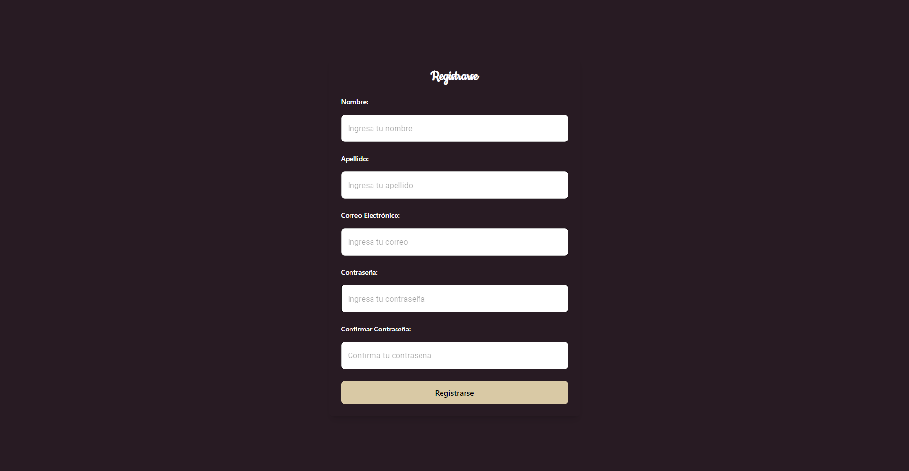
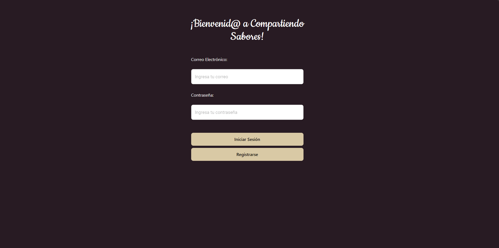
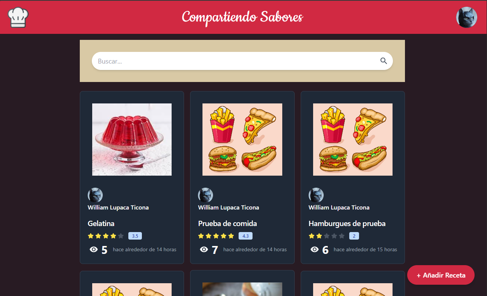
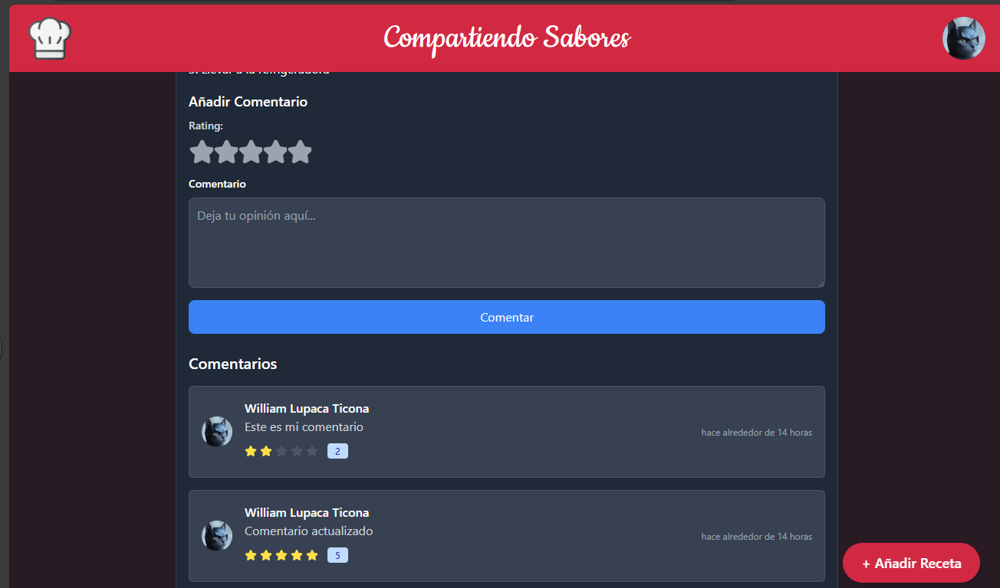
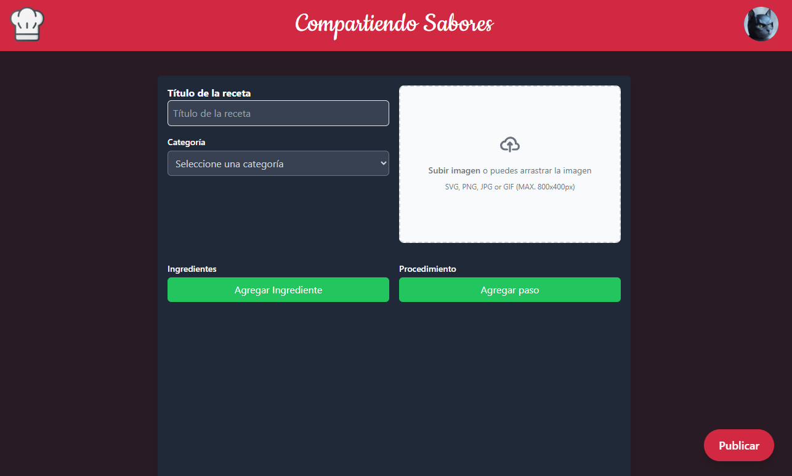
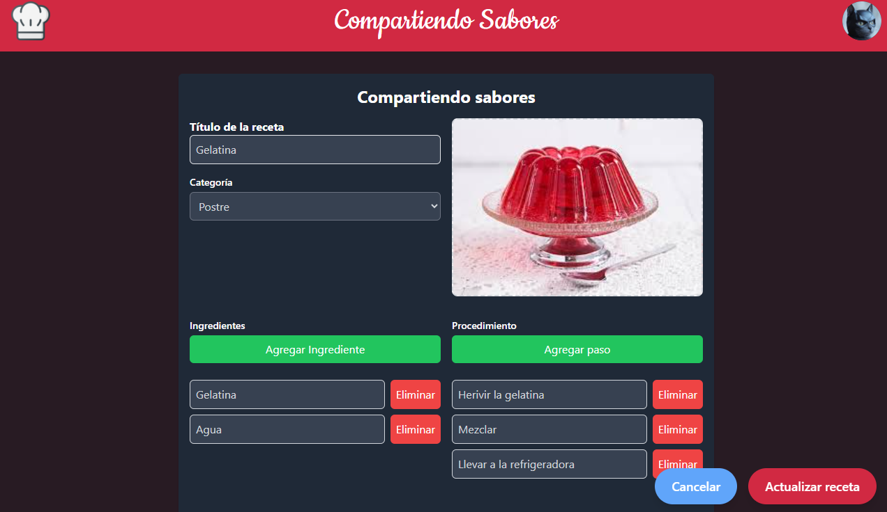
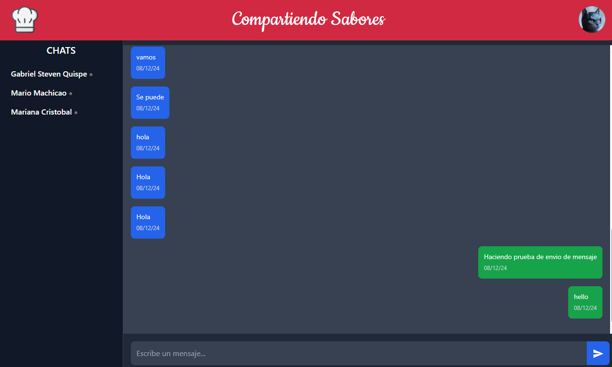
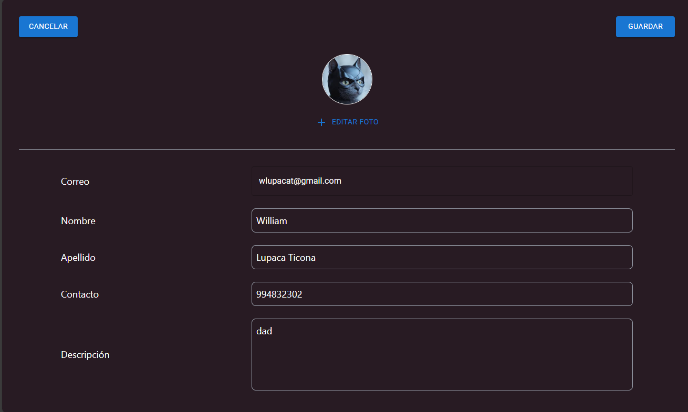

# Compartiendo Sabores

¡Bienvenido al proyecto **Compartiendo Sabores**! Esta es una plataforma donde los amantes de la cocina pueden compartir recetas, descubrir nuevos platos y conectarse con otros entusiastas culinarios.

- **Link de proyecto:** https://compartiendosabores.netlify.app/

---

## Características

- **Publicación de recetas**: Crea, edita y comparte tus propias recetas con la comunidad.
- **Visualización de recetas**: Explora recetas detalladas con ingredientes, procedimientos e imágenes.
- **Comentarios y valoraciones**: Deja comentarios y califica las recetas de otros usuarios.
- **Favoritos**: Guarda tus recetas favoritas para acceder a ellas fácilmente.
- **Mensajería en tiempo real**: Comunícate con otros usuarios a través del chat integrado.

---

## Tecnologías Utilizadas

### Frontend:

- **React** con **TypeScript**
- **Redux Toolkit** para el manejo del estado global
- **React Hook Form** para la gestión de formularios
- **Material UI** y **Tailwind CSS** para estilos y componentes UI
- **Vite** como herramienta de desarrollo y compilación
- **Cloudinary** para guardar imágenes.

### Backend:

- **Link del repositorio de backend:** https://github.com/GabrielMaQui/mir-individual-sharing-flavors.git

---

## Estructura del Proyecto

La estructura principal del proyecto es la siguiente:

```
src/
|-- app/          # Configuración de Redux y API endpoints
|-- componentes/  # Componentes reutilizables como tarjetas de recetas y formularios
|-- hooks/        # Hooks personalizados
|-- interfaces/   # Definiciones de tipos e interfaces
|-- pages/        # Páginas principales de la aplicación
|-- utils/        # Funciones utilitarias y validaciones
```

---

## Instalación y Ejecución

1. **Clonar el repositorio**:

   ```bash
   git clone <URL del repositorio>
   cd compartiendo-sabores
   ```

2. **Instalar dependencias**:

   ```bash
   npm install
   ```

3. **Configurar variables de entorno**:

   - Copia el archivo `.env.example` y renómbralo a `.env`.
   - Completa las variables necesarias en el archivo.

4. **Iniciar la aplicación**:
   ```bash
   npm run dev
   ```

---

## Scripts Disponibles

- `npm run dev`: Inicia el servidor de desarrollo.
- `npm run build`: Compila la aplicación para producción.
- `npm run lint`: Ejecuta el linter para mantener la calidad del código.
- `npm run preview`: Previsualiza la versión compilada.

---

## Contribución

Las contribuciones son bienvenidas. Por favor, sigue las pautas establecidas y mantén un estilo de código consistente.

---

## Licencia

---

¡Gracias por ser parte de Compartiendo Sabores! Si tienes preguntas o sugerencias, no dudes en contactarnos.

## Funcionalides implementadas

- **Registro de usuarios**: Permite a los nuevos usuarios crear una cuenta en la plataforma.
  
- **Login**: Autentica a los usuarios existentes para acceder a sus cuentas.
  
- **Home**: Página principal que muestra las recetas más recientes.
  
- **Comentarios**: Los usuarios pueden dejar comentarios en las recetas.
  
- **Publicar receta**: Los usuarios pueden crear y compartir nuevas recetas.
  
- **Editar receta**: Los usuarios pueden modificar sus recetas publicadas.
  
- **Chat**: Comunicación en tiempo real entre los usuarios.
  
- **Edición de perfil**
  

## Autores

- GitHub - [William Lupaca Ticona](https://github.com/PunoBootcamper)
- Github - [Gabriel Steven Machicao Quispe](https://github.com/gabriel7529)
